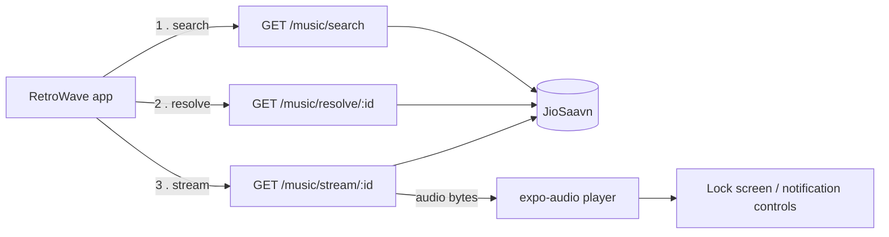
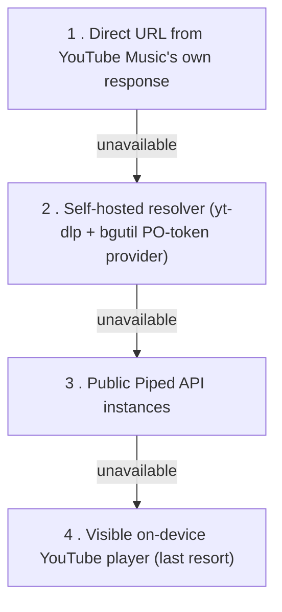

<p align="center">
  
</p>

<h1 align="center">RetroWave</h1>
<p align="center">A retro hi-fi–styled music player built with Expo and React Native.</p>

<p align="center">
  
  
  
  
</p>

Vinyl discs, tape decks, and J-cards — RetroWave wraps free, login-free music
search and streaming in a warm analog interface. No accounts, no ads, no
tracking: pick a song and the deck starts spinning.

## Download for Android

Open [GitHub Releases](https://github.com/AdnanJukker/Retro-MusicApp/releases/latest)
and download the `.apk` under **Assets**. Open it on your Android phone to install;
Android may ask you to allow installation from your browser or file manager.
An internet connection is required for music playback.

Maintainers: see [RELEASING.md](RELEASING.md) for the build and publishing steps.

## Features

- **Search** — a JioSaavn-backed catalog, no account or API key needed
- **Background playback** — keeps playing when you switch apps, with lock
  screen and notification transport controls (play/pause, 10s seek)
- **Library** — favorites and listening history saved on-device
- **Queue controls** — shuffle, repeat (off / all / one), and an on-deck queue
- **Lyrics view**, artist pages, and playlists
- **Retro hi-fi UI** — a spinning vinyl disc, tape/J-card motifs, and a warm
  analog color palette (see [`src/constants/theme.ts`](src/constants/theme.ts))
- **Resilient playback** — a multi-step fallback chain keeps a song playing
  even when one source is blocked or rate-limited

## How it works

RetroWave is two pieces: the Expo/React Native app in this repo, and a small
FastAPI resolver service in [`server/`](server) that talks to the actual music
sources. The client never calls JioSaavn or YouTube directly — it always goes
through the resolver, which strips cookies/DRM concerns out of the picture and
hands back a plain streamable URL.

**Search and playback (current catalog, JioSaavn):**



**Fallback chain for existing saved YouTube tracks:** the app tries each step
in order and moves to the next only on failure, so a song keeps playing even
when the primary path is blocked.



The resolver never stores or transcodes audio — it fetches fresh upstream URLs
per request and relays the byte range straight through. See
[`server/README.md`](server/README.md) and [`CLAUDE.md`](CLAUDE.md) for the
full details, hard constraints (no logins, no cookies, no DRM decoding), and
why the fallback chain exists.

## Tech stack

**App** — Expo (SDK 57), React Native, TypeScript, [expo-router](https://docs.expo.dev/router/introduction/)
for file-based navigation, [Zustand](https://github.com/pmndrs/zustand) for
state, `expo-audio` for background playback and lock screen metadata, and
`react-native-youtube-iframe` for the device-player fallback.

**Backend** (`server/`) — FastAPI (Python), yt-dlp, the bgutil PO-token
provider, packaged with Docker and deployed on Render.

## Project structure

```
src/
  app/            expo-router screens — (tabs)/home, search, library,
                  player, lyrics, artist/[id], playlist/[id], settings
  components/     shared UI (VinylDisc, PlayerControls, MiniPlayer, ...)
  services/       audioEngine (playback + lock screen), musicService,
                  youtubeMusic/ (InnerTube client + stream resolver)
  store/          Zustand playerStore (queue, favorites, history, prefs)
  constants/      theme tokens (the retro/analog design system)
server/           FastAPI resolver: JioSaavn adapter + yt-dlp fallback
```

## Get started

1. Install dependencies

   ```bash
   npm install
   ```

2. Start the app

   ```bash
   npx expo start
   ```

   In the output you'll find options to open the app in a
   [development build](https://docs.expo.dev/develop/development-builds/introduction/),
   an [Android emulator](https://docs.expo.dev/workflow/android-studio-emulator/),
   an [iOS simulator](https://docs.expo.dev/workflow/ios-simulator/), or
   [Expo Go](https://expo.dev/go).

By default the app talks to the production resolver at
`https://retro-musicapp.onrender.com`, so playback works out of the box with
no setup. To point at a local or staging backend instead, copy `.env.example`
to `.env` and set:

| Variable | Purpose |
| --- | --- |
| `EXPO_PUBLIC_STREAM_RESOLVER_URL` | Base URL of your own `server/` deployment (search, resolve, stream, lyrics). |
| `EXPO_PUBLIC_PIPED_INSTANCES` | Comma-separated Piped-API instances, tried only for legacy YouTube tracks if the resolver above fails. |
| `EXPO_PUBLIC_MUSIC_API_BASE_URL` | Legacy provider fallback; currently unused by the app. |

To run the resolver locally, see [`server/README.md`](server/README.md):

```bash
cd server
pip install -r requirements.txt
uvicorn main:app --reload --port 8000
```

### Checks

```bash
npm run typecheck   # TypeScript
npm run lint        # ESLint
npm test            # Playback/store unit tests
npm run test:playback -- http://127.0.0.1:8000   # Live search-to-audio smoke test
```

## License

[MIT](LICENSE)
